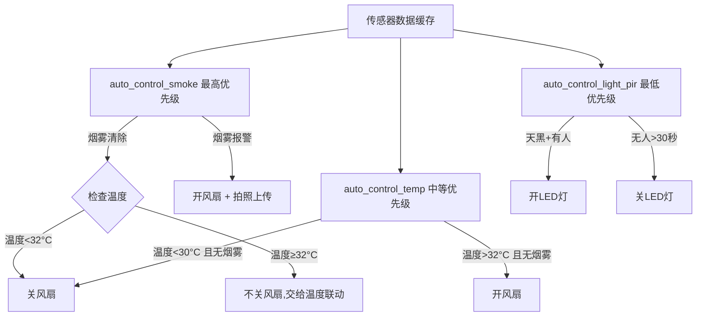
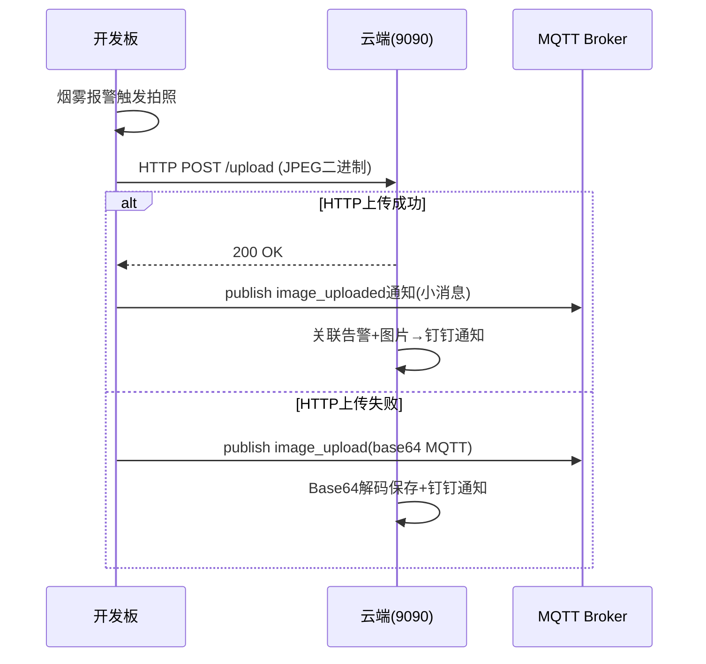

# CLAUDE.md — 嵌入式物联网智慧环境监控系统

本文件提供项目完整的技术文档和开发指南。

## 项目概览

基于 **NXP i.MX6ULL ARM Cortex-A7** 平台的嵌入式物联网(IoT)智慧环境监控系统。
**五层分层架构**：内核驱动层 → HAL硬件抽象层 → RPC服务层 → 应用客户端层 → 云端层。

```
硬件外设 → 内核驱动(.ko) → rpc_server(端口1234) → MQTT Bridge → MQTT Broker → Python脚本 → InfluxDB/Grafana
                                                       → Web管理界面(HTTP 8080)
                                                       → RPC Client(命令行/Qt客户端)
```

### 硬件资源

| 外设 | 引脚/接口 | 说明 |
|------|----------|------|
| LED (板载) | GPIO131 | /dev/100ask_led 驱动控制 |
| DHT11 温湿度 | GPIO115 | /dev/mydht11 驱动，中断+定时器解析单总线协议 |
| PIR 人体红外 | GPIO116 | 数字输入 (0无人/1有人) |
| 烟雾传感器 DO | GPIO117 | 数字输入 (0检测到烟雾/1正常) |
| 继电器1 (风扇) | GPIO118 | 数字输出 |
| 继电器2 (LED灯) | GPIO119 | 数字输出 |
| 光敏电阻 ADC | ADC通道3 | /sys/bus/iio/devices/iio:device0/in_voltage3_raw |
| USB摄像头 | /dev/video1 | V4L2 MJPEG 格式，640x480 |

### 软件架构总览

| 层 | 模块 | 语言 | 说明 |
|----|------|------|------|
| 驱动层 | dht11_drv.ko, led_drv.ko | C (内核) | GPIO中断+定时器解析单总线协议 |
| HAL层 | hal.h/c | C | 硬件抽象接口，所有硬件操作经过此层 |
| RPC服务层 | rpc_server (lesson5) | C | JSON-RPC over TCP，端口1234 |
| HTTP服务 | http_server (lesson5) | C | 轻量级HTTP服务器，端口8080 |
| MQTT网关 | mqtt_bridge (lesson6) | C++ | 智能网关，事件驱动上报+自动控制 |
| 数据缓存 | data_cache (lesson6) | C | 环形缓冲区，断网缓存+重传 |
| 配置管理 | config (lesson6) | C | JSON配置文件+环境变量组合加载 |
| 日志系统 | log (lesson6) | C | 分级日志，文件轮转 |
| 系统监控 | system_monitor (lesson6) | C | CPU/内存/负载/运行时间 |
| 设备认证 | device_auth (lesson6) | C | MAC地址ID + Token管理 |
| OTA升级 | ota_manager (lesson6) | C | wget下载+校验+备份+回滚 |
| 消息队列 | msg_queue (lesson6) | C | 支持优先级和超时的线程安全队列 |
| 传感器管理器 | sensor_manager (lesson6) | C | 即插即用统一管理 |
| 摄像头管理 | camera_manager (lesson5/6) | C | V4L2 MJPEG 抓拍+Base64编码 |
| 安全审计 | security_audit (lesson6) | C | 事件记录+IP锁定+证书检查 |
| 数据安全 | crypto_utils (lesson6) | C | SHA-256+XOR加密+数据脱敏 |
| 内存池 | memory_pool (lesson6) | C | 固定大小池+泄漏检测 |
| 性能监控 | perf_monitor (lesson6) | C | 监控点+快照+阈值告警 |
| 插件管理器 | plugin_manager (lesson6) | C | dlopen动态加载 |
| 设备发现 | device_discovery (lesson6) | C | UDP广播发现 |
| 共享库 | shared_lib | C | cJSON + watchdog 公共模块 |
| 云端 | mqtt_to_influxdb.py | Python | MQTT→InfluxDB桥接+HTTP图片服务+钉钉告警 |
| 可视化 | Grafana | YAML/JSON | Docker部署，预置仪表板 |

---

## 目录结构

```
.
├── lesson5/                      # RPC服务器层
│   ├── rpc_server/               # 核心RPC服务 + HTTP管理
│   │   ├── rpc_server.c          # RPC服务器主程序，注册9个方法
│   │   ├── hal.h/c               # 硬件抽象层（核心设计）
│   │   ├── dht11.h/c             # DHT11设备驱动封装（/dev/mydht11）
│   │   ├── led.h/c               # LED设备驱动封装（/dev/100ask_led）
│   │   ├── http_server.h/c       # 轻量级HTTP服务器
│   │   ├── web_api.c             # Web API实现（传感器/继电器/摄像头/配置等）
│   │   ├── camera_manager.h/c    # V4L2摄像头管理
│   │   └── www/index.html        # Web管理前端
│   ├── rpc_client/               # 命令行RPC客户端（旧版）
│   ├── jsonrpc-c/                # JSON-RPC库（静态编译）
│   ├── libev/                    # libev事件循环库（静态编译）
│   └── LED_and_TempHumi/         # Qt客户端（旧版，Qt 4.8）
├── lesson6/                      # MQTT智能网关层
│   ├── mqtt_bridge.cpp           # MQTT桥接主程序（核心）
│   ├── rpc_client.h/cpp          # RPC客户端库（线程安全，带超时重连）
│   ├── config.h/c                # 配置管理
│   ├── log.h/c                   # 日志系统
│   ├── error.h/c                 # 统一错误码框架
│   ├── data_cache.h/c            # 数据缓存（环形缓冲区）
│   ├── system_monitor.h/c        # 系统监控
│   ├── device_auth.h/c           # 设备认证
│   ├── ota_manager.h/c           # OTA升级
│   ├── msg_queue.h/c             # 消息队列
│   ├── sensor_manager.h/c        # 传感器管理器
│   ├── camera_manager.h/c        # 摄像头管理（V4L2+log版）
│   ├── security_audit.h/c        # 安全审计
│   ├── crypto_utils.h/c          # 数据安全
│   ├── memory_pool.h/c           # 内存池
│   ├── perf_monitor.h/c          # 性能监控
│   ├── plugin_manager.h/c        # 插件管理器
│   ├── device_discovery.h/c      # 设备发现
│   ├── test_cases.c              # 单元测试
│   ├── test_framework.h          # 测试框架
│   └── include/                  # 第三方库头文件
│       ├── mqttclient/           # MQTT客户端库（C语言）
│       ├── mqtt/                 # MQTT协议核心
│       ├── mbedtls/              # mbedTLS加密库
│       ├── network/              # 网络层抽象
│       ├── platform/             # 平台适配层
│       └── common/               # 公共工具
├── cloud/                        # 云端服务
│   └── mqtt_to_influxdb.py       # MQTT→InfluxDB桥接+HTTP图片+钉钉告警
├── grafana/                      # Grafana可视化
│   ├── docker-compose.yml        # Docker部署（InfluxDB+Grafana+Telegraf）
│   └── grafana/provisioning/     # 自动配置
├── shared_lib/                   # 公共静态库
│   ├── include/                  # 公共头文件
│   │   ├── cJSON.h               # JSON解析器
│   │   ├── watchdog.h            # 软件看门狗
│   │   └── shared.h              # 统一包含头文件
│   └── src/
│       ├── cJSON.c               # cJSON实现
│       └── watchdog.c            # 看门狗实现
├── 驱动库源码/                   # 内核驱动源码
│   ├── dht11/dht11_drv.c         # DHT11驱动（中断+定时器）
│   └── led/led_drv.c             # LED GPIO驱动
├── config.json                   # 系统配置文件
├── .env.example                  # 环境变量模板
├── check_all.sh                  # 一键检查脚本
├── snapshot.sh                   # 快照管理脚本
└── CLAUDE.md / CURRENT.md        # 项目文档
```

---

## 核心技术细节

### 1. JSON-RPC 协议

基于 jsonrpc-c 库 + libev 事件循环，TCP 端口 1234。

**注册的9个RPC方法：**

| 方法 | 参数 | 返回值 | 说明 |
|------|------|--------|------|
| `led_control` | [status] | 0成功/-1失败 | LED控制 |
| `dht11_read` | [0] | [humi, temp] | 温湿度读取 |
| `pir_read` | [] | 0无人/1有人/-1错误 | 人体红外 |
| `light_read` | [] | 0明亮/1黑暗/-1错误 | 光照检测 |
| `relay_control` | [status] | 0成功/-1失败 | 继电器1（风扇） |
| `relay_read` | [] | 0关闭/1打开 | 继电器1状态 |
| `relay2_control` | [status] | 0成功/-1失败 | 继电器2（LED灯） |
| `relay2_read` | [] | 0关闭/1打开 | 继电器2状态 |
| `smoke_digital_read` | [] | 0烟雾/1正常/-1错误 | 烟雾检测 |

### 2. HAL层设计（核心架构决策）

`hal.h` + `hal.c` 封装所有硬件操作，换开发板只需重写 hal.c。

**HAL功能划分：**

| 子系统 | 接口 | 硬件操作 |
|--------|------|----------|
| GPIO | export/unexport/set_direction/read/write | /sys/class/gpio/ |
| ADC | init/read_raw/read_voltage | /sys/bus/iio/devices/iio:device0/ |
| 传感器 | dht11_read/pir_read/light_read/smoke_digital_read | 驱动+GPIO+ADC |
| 执行器 | led_control/relay1_control/relay2_control | 驱动+GPIO |
| 传感器状态管理 | get_status | 连续失败5次标记离线，60秒重试 |

**数据滤波：**
- 温度：滑动平均窗口3
- 湿度：滑动平均窗口3
- 光照：滑动平均窗口5

**烟雾防抖：**
- 连续3次读取同一状态才确认变化
- 防止传感器抖动导致误报

### 3. MQTT Bridge (核心)

`lesson6/mqtt_bridge.cpp` — 智能网关，连接MQTT Broker和本地RPC服务。

**MQTT主题：**

| 主题 | 方向 | QoS | 说明 |
|------|------|-----|------|
| `device/control` | 订阅 | QOS1 | 云端控制指令 |
| `device/response` | 发布 | QOS1 | RPC执行结果 |
| `device/telemetry` | 发布 | QOS1 | 传感器遥测数据 |
| `device/alert` | 发布 | QOS1 | 告警+图片+错误报告 |
| `device/heartbeat` | 发布 | QOS0 | 心跳指标 |

**事件驱动上报机制：**
- 首次读取立即上报
- 状态变化立即上报（PIR/光照/烟雾/继电器状态变化）
- 温度变化≥1°C或湿度变化≥5%上报
- 每5分钟强制全量上报
- MQTT离线时缓存数据（环形缓冲区100条），恢复后重传

**线程架构：**
```
主线程（main）
  ├── 喂狗循环 (sleep 1s)
  ├── MQTT网络线程 (mqttclient库内部)
  │   └── message_handler() → 入队cmd_queue
  ├── 命令工作线程 (cmd_worker_thread)
  │   └── msgq_receive → process_message_payload → RPC调用
  └── 遥测线程 (telemetry_thread_func, 每5秒)
      ├── refresh_sensor_cache() → 读取所有传感器
      ├── publish_telemetry() → MQTT事件上报
      ├── auto_control() → 边缘自动控制
      └── publish_heartbeat() → 每60秒心跳
```

**线程安全注意事项：**
- `fan_state`、`led_state` 被遥测线程和命令工作线程共享，**当前无显式锁保护**
- RPC客户端使用 `pthread_mutex_t` 保护 socket 操作（线程安全）

### 4. 边缘自动控制（滞后控制+优先级）



**自动控制优先级：烟雾联动 > 温度联动 > 光照+PIR联动**

**关键协调逻辑（已修复2026-06-07）：**
- `smoke_fan_until` 初始值0，用 `> 0` 保护避免 `now >= 0` 永远为真
- 烟雾定时器到期时自动检查温度，温度仍高就不关风扇交给温度联动
- 烟雾报警期间抑制温度控制，防止继电器反复跳匝

### 5. Web API (HTTP 8080)

轻量级HTTP服务器，支持静态文件服务和REST API。

**API端点一览：**

| 端点 | 方法 | 说明 | 认证 |
|------|------|------|------|
| `/api/sensors` | GET | 所有传感器+继电器状态 | 否 |
| `/api/relay/1\|/2` | GET | 读取继电器状态 | 否 |
| `/api/relay/1\|/2/control` | POST | 控制继电器 | 否 |
| `/api/led/control` | POST | 控制LED | 否 |
| `/api/system` | GET | 系统状态（uptime/内存） | 否 |
| `/api/sensor_status` | GET | 传感器在线/离线状态 | 否 |
| `/api/device_info` | GET | 设备信息（主机名/内核/磁盘） | 否 |
| `/api/camera/capture` | GET | 抓拍并保存 | 否 |
| `/api/camera/list` | GET | 图片列表 | 否 |
| `/api/camera/view` | GET | 查看图片（Base64） | 否 |
| `/api/ota/upgrade` | POST | 触发OTA升级 | 否 |
| `/api/ota/status` | GET | OTA状态 | 否 |
| `/api/ota/rollback` | POST | 回滚固件 | 否 |
| `/api/config/get` | GET | 读取配置 | 否 |
| `/api/config/update` | POST | 更新配置 | 否 |
| `/api/logs` | GET | 查看日志（?level=error） | 否 |
| `/api/auth/login` | POST | 登录 | 否 |
| `/api/auth/logout` | POST | 登出 | 需Token |
| `/api/auth/check` | GET | 检查Token有效性 | 否 |
| `/api/auth/change_password` | POST | 修改密码 | 需Token |
| `/api/export` | GET | 数据导出（?format=csv） | 否 |

**认证机制：**
- Token认证，有效期24小时
- 密码SHA-256加盐哈希（混合设备hostname+machine）
- 首次启动生成随机密码并打印到控制台
- Session存储在 `/tmp/web_sessions.json`
- 默认用户名/密码：admin/admin（首次启动后变随机）

### 6. 云端服务 (`cloud/mqtt_to_influxdb.py`)

部署在阿里云服务器 (8.140.232.52)，Docker部署。

**功能模块：**
- **MQTT订阅**：订阅4个主题（telemetry/response/alert/heartbeat）
- **InfluxDB写入**：传感器数据写入 `sensor_data` 测量，心跳写入 `device_heartbeat`
- **HTTP图片服务器**：端口9090，接收JPEG上传，提供图片下载
- **钉钉告警**：告警消息+图片通知到钉钉群
- **错误报告**：HIGH/CRITICAL级别错误触发钉钉通知
- **超时处理**：等待图片30秒超时机制

**部署命令：**
```bash
cd /opt/iot_mqtt_to_influx && nohup python3 -u mqtt_to_influxdb.py > mqtt_to_influxdb.log 2>&1 &
```

### 7. 图片传输方案（双通道）



### 8. 配置管理

**加载优先级：环境变量 > 配置文件 > 默认值**

- **`config.json`** — JSON格式，6大配置节：mqtt/topics/gpio/adc/thresholds/intervals/rpc
- **`.env`/环境变量** — MQTT_HOST/MQTT_USERNAME/MQTT_PASSWORD 等
- **systemd** — `EnvironmentFile=/root/.env`

**关键阈值参数（默认值）：**

| 参数 | 默认值 | 说明 |
|------|--------|------|
| temp_high | 32°C | 温度上限，超过开风扇 |
| temp_low | 30°C | 温度下限，低于关风扇（滞后） |
| smoke_alert_level | 0 | 烟雾报警电平 |
| smoke_fan_duration | 30s | 烟雾联动风扇持续时间 |
| smoke_alert_interval | 10s | 告警发送间隔 |
| smoke_fault_timeout | 60s | 持续报警判定为传感器故障 |
| pir_off_delay | 30s | PIR无人后关灯延时 |
| light_threshold | 2000 | 光照ADC阈值 |
| telemetry | 5s | 遥测采集间隔 |
| heartbeat | 60s | 心跳上报间隔 |
| full_report | 300s | 全量上报间隔 |

### 9. 传感器故障恢复机制

```
读取失败 → failure_count++
         └→ failure_count ≥ 5 → 标记为 HAL_SENSOR_STATUS_OFFLINE
                                 └→ 后续读取立即返回 HAL_ERROR_SENSOR_OFFLINE
                                     └→ 60秒后自动重试（retry_interval）
                                         └→ 成功则恢复 ONLINE
```

### 10. OTA升级流程

```
ota_start_upgrade()
  ├── 步骤1: wget下载固件到 /tmp/firmware.bin
  ├── 步骤2: MD5/SHA256校验和验证
  ├── 步骤3: cp备份当前固件 /etc/device/firmware_backup.bin
  ├── 步骤4: cp安装新固件到 /usr/local/bin/mqtt_bridge
  └── 步骤5: systemctl restart mqtt_bridge
  失败时回滚：cp backup → mqtt_bridge
```

---

## 构建命令

### ARM交叉编译（宿主机）

**工具链：** `arm-buildroot-linux-gnueabihf-gcc/g++ 7.5.0`
**SDK路径：** `/home/book/100ask_imx6ull-sdk/`

```bash
# 共享库（先编译）
cd shared_lib && make clean && make

# RPC Server
cd lesson5/rpc_server && make clean && make

# MQTT Bridge (Release)
cd lesson6 && make clean && make

# MQTT Bridge (Debug)
cd lesson6 && make clean && make debug

# RPC Client
cd lesson5/rpc_client && make clean && make

# 一键检查全部
bash check_all.sh
```

### 本地测试

```bash
# 单元测试（不依赖硬件）
cd lesson6 && gcc -DTEST_MAIN -o test test_cases.c error.c config.c -I../shared_lib/include ../shared_lib/src/cJSON.c -lm -I. && ./test && rm -f test

# 静态分析
cd lesson6 && make cppcheck
cd lesson6 && make clang-tidy
cd lesson6 && make valgrind
```

### 快照管理

```bash
./snapshot.sh save "修改说明"   # 改代码前拍快照
./snapshot.sh restore <编号>    # 恢复
```

---

## 板端验证命令

```bash
# Web API
curl http://localhost:8080/api/sensors
curl http://localhost:8080/api/relay/1/control -X POST -d '{"state":1}'
curl http://localhost:8080/api/camera/capture
curl http://localhost:8080/api/logs?level=error
curl http://localhost:8080/api/system

# 硬件直读
cat /sys/class/gpio/gpio116/value   # PIR
cat /sys/class/gpio/gpio117/value   # 烟雾
cat /sys/bus/iio/devices/iio:device0/in_voltage3_raw  # 光敏

# MQTT远程控制
mosquitto_pub -h localhost -t "device/control" \
  -m '{"method":"led_control","params":[1]}' -u <user> -P "<pass>"

mosquitto_sub -h localhost -t "device/telemetry" -u <user> -P "<pass>"

# 日志
journalctl -u rpc_server -f
journalctl -u mqtt_bridge -f
```

---

## 已知问题

1. **竞态条件** — `fan_state`、`led_state` 被遥测线程和命令工作线程共享，无互斥锁保护。参见 CURRENT.md 2026-06-07。

2. **check_all.sh 误报** — grep "/sys" 会命中 "/api/system"；硬编码IP 8.140.232.52 是阿里云固定地址，属于合理硬编码。

3. **单元测试编译命令过时** — cJSON 已移入 shared_lib，测试需指定 `-I../shared_lib/include ../shared_lib/src/cJSON.c`。

4. **MQTT连接稳定性** — 错误码 -4 表示TCP连接失败，有自动重连机制（5次，5秒间隔）。

5. **共享库已抽离** — cJSON 和 watchdog 已移入 shared_lib，lesson5/lesson6 通过 Makefile 引用。

## 重要设计原则

- **所有硬件操作必须通过 HAL 接口**，禁止直接操作 sysfs
- **ARM平台 char 默认 unsigned** (0~255)，不要与 -1 比较
- **敏感信息禁止硬编码**（INFLUXDB_TOKEN、MQTT_PASS、DINGTALK_WEBHOOK）
- **`.snapshots/` 目录不提交**，已在 .gitignore 中排除
- **新公共模块放 shared_lib/**，消除代码重复
