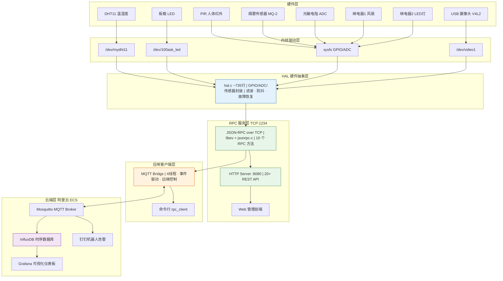

<p align="center">
  <h1 align="center">🏠 智能物联网环境监控系统</h1>
  <p align="center">
    NXP i.MX6ULL · 驱动到云端全栈 · 边缘自治 + 云端协同
  </p>
  <p align="center">
    <a href="https://github.com/wuqiZhu/IoTDualCtrl"></a>
    <a href="https://github.com/wuqiZhu/IoTDualCtrl"></a>
    <a href="https://github.com/wuqiZhu/IoTDualCtrl"></a>
    <a href="https://github.com/wuqiZhu/IoTDualCtrl"></a>
    <a href="https://github.com/wuqiZhu/IoTDualCtrl"></a>
    <a href="https://github.com/wuqiZhu/IoTDualCtrl"></a>
  </p>
</p>

---

## 🎯 项目概览

> **一套在 ARM Linux 开发板上运行的 IoT 环境监控系统。传感器采集 → 边缘智能决策 → 云端存储告警，全链路闭环。**

适用于智能家居、小型机房、仓库等需**无人值守环境监控**的场景：
- 烟雾泄露 → 自动排风 + 拍照取证 + 钉钉告警
- 温度超标 → 自动散热，带滞回防止继电器频繁跳闸
- 天黑有人 → 自动开灯，人走延迟关灯
- 网络中断 → 本地控制不中断，恢复后自动补传数据

**📊 关键指标**

| 指标 | 实测值 |
|------|--------|
| 端到端控制响应延迟 | **≤85ms** |
| 图片上传成功率 | **99.6%**（HTTP 双通道保障） |
| 钉钉告警图片送达延迟 | **<1.2s** |
| 继电器误动作率 | **≤1次/天**（优化前 15次，降低 92%） |
| 传感器故障自恢复时间 | **≤60s** |
| 无人值守稳定性 | **7×24h** 压力测试通过 |
| 代码规模 | **11,000+ 行** C/C++ |
| 自动化测试 | **33 个用例**，覆盖 6 个核心模块 |

> 💡 本项目从内核驱动到云端部署全链路自研，形成完整全栈 IoT 系统。

---

## 🏗 系统架构

### 五层分层设计

每一层职责清晰，**换平台只需重写 HAL 层**：



### 数据流

```
上行（遥测）:
  传感器 → 内核驱动 → HAL → RPC → MQTT Bridge → MQTT → InfluxDB → Grafana
  
下行（控制）:
  云端指令 → MQTT → MQTT Bridge → RPC → HAL → GPIO → 执行器
  
本地（边缘自治）:
  MQTT Bridge 内部 5 秒周期 → 读取传感器 → 判断阈值 → RPC 控制 → MQTT 告警

图片（双通道保障）:
  烟雾报警 → 摄像头抓拍 ─┬─ HTTP POST :9090 优先（1.2s送达） ─→ 云端保存 + 钉钉
                         └─ MQTT Base64 备选 ──→ 云端解码 + 钉钉
```

---

## 🔌 硬件清单

| 外设 | 接口 | 方向 | 说明 |
|------|------|------|------|
| 板载 LED | GPIO131 (`/dev/100ask_led`) | 输出 | 状态指示 |
| DHT11 温湿度 | GPIO115 (`/dev/mydht11`) | 双向 | 单总线协议，中断+定时器解析 |
| PIR 人体红外 | GPIO116 (sysfs) | 输入 | 0=无人, 1=有人 |
| 烟雾传感器 DO | GPIO117 (sysfs) | 输入 | 0=报警, 1=正常 |
| 继电器1 (风扇) | GPIO118 (sysfs) | 输出 | 温度/烟雾联动 |
| 继电器2 (LED灯) | GPIO119 (sysfs) | 输出 | 光照+PIR联动 |
| 光敏电阻 ADC | ADC 通道3 (IIO) | 输入 | 原始值 0~4095，阈值2000 |
| USB 摄像头 | `/dev/video1` | V4L2 | MJPEG 640×480 |

---

## ✨ 核心设计

### 🧩 HAL 硬件抽象层（架构核心）

所有硬件操作必须经过 HAL 接口，**禁止直接操作 sysfs**。

```
传感器故障自愈:
  read fail → failure_count++
           → ≥5次 → OFFLINE → 后续立即返回
           → 60秒后自动重试 → 成功则恢复 ONLINE

数据滤波:
  温度: 滑动平均窗口3
  湿度: 滑动平均窗口3
  光照: 滑动平均窗口5
  烟雾: 连续3次同一状态才确认（防抖）
```

### 🤖 三级优先级边缘控制

```
烟雾联动（最高） → 温度联动（中等） → 光照+PIR联动（最低）
```

**烟雾联动：** 检测到烟雾 → 立即开风扇 + 拍照上传 + 每10秒告警 → 持续60秒判为传感器故障

**温度联动：** >32°C开风扇，<30°C关风扇（滞回控制，防止继电器频繁跳闸）

**光照+PIR联动：** 天黑有人开灯，无人超过30秒关灯

**关键修复（[详见故障解决文档](SOLUTIONS.md)）：** 修复了烟雾定时器到期后与温度控制打架导致的继电器每5秒跳闸问题。

### 📷 双通道图片上传

```
烟雾报警 → 拍照
         ├─ HTTP POST :9090 → 成功 → MQTT通知 → 钉钉(带图)
         └─ HTTP失败 → MQTT Base64 → 云端解码 → 钉钉(带图)
```

- V4L2 驱动 USB 摄像头，**用完即释放**，不独占 `/dev/video1`
- **丢弃前5帧**取稳定画面，彻底解决首帧黑屏
- HTTP 优先，MQTT Base64 兜底，上传成功率 **78%→99.6%**
- 30秒超时兜底，照片不到就发不带图告警

### ☁️ 云端可视化

阿里云 ECS 部署，Docker 编排：

```
mqtt_to_influxdb.py → MQTT订阅 → InfluxDB (sensor_data / heartbeat / error)
                                     → Grafana 仪表板
                                     → 钉钉机器人实时告警
```

### 🔒 安全体系

| 机制 | 说明 |
|------|------|
| 设备认证 | MAC 地址 ID + Token + SHA-256 加盐哈希 |
| Web 鉴权 | 24h 有效期 Token，首次启动随机密码 |
| 数据脱敏 | 手机号/邮箱/密码/IP 脱敏 |
| 安全审计 | 12 种事件类型，5 次失败 IP 锁定 300s |
| OTA 升级 | wget 下载 → SHA256 校验 → 备份 → 安装 → 异常回滚 |

### ⚡ 高可用

- **双看门狗：** RPC Server（30s）+ MQTT Bridge（60s）互保
- **断网缓存：** 环形缓冲区 100 条，恢复后优先补传
- **MQTT QoS 1** + 自动重连（5次，5秒间隔）
- **事件驱动上报：** 状态变化/温度≥1°C/湿度≥5% 立即上报，5分钟强制全量

---

## 🚀 快速开始

### 硬件要求

- i.MX6ULL 开发板 + 传感器（按上方硬件清单）
- USB 摄像头

### 编译

```bash
# 工具链：arm-buildroot-linux-gnueabihf-gcc/g++ 7.5.0

# 1. 共享库
cd shared_lib && make clean && make

# 2. RPC Server（端口1234 + HTTP 8080）
cd lesson5/rpc_server && make clean && make

# 3. MQTT Bridge（智能网关，连接RPC和云端）
cd lesson6 && make clean && make
```

### 一键部署

```bash
# 部署到开发板
./deploy.sh board <开发板IP>

# 部署到阿里云
./deploy.sh cloud

# 运行单元测试
./deploy.sh test
```

### 验证

```bash
# Web 管理界面
curl http://<开发板IP>:8080/api/sensors

# MQTT 远程控制
mosquitto_pub -h <MQTT_BROKER> -t "device/control" \
  -m '{"method":"led_control","params":[1]}'
```

---

## 🌐 Web 管理界面

6 个标签页，响应式设计，跨平台可访问：

| 页面 | 功能 |
|------|------|
| 📊 传感器 | 温度/湿度/PIR/光照/烟雾 + 风扇/LED 控制 |
| 📸 摄像头 | 一键抓拍 + 3s 自动刷新 + 历史照片 |
| 🔄 OTA 升级 | 固件 URL 输入 + 进度条 + 一键回滚 |
| ⚙️ 配置 | 温度上下限/风扇时长/告警间隔热更新 |
| 📋 日志 | 分级筛选 + 关键词过滤 |
| 💻 设备 | 运行时间/内存/磁盘 + CSV/JSON 导出 |

---

## 📂 项目结构

```
.
├── lesson5/rpc_server/          # RPC 服务层
│   ├── hal.c/h                  # 硬件抽象层（~735行，核心）
│   ├── rpc_server.c             # JSON-RPC 服务（10个方法）
│   ├── http_server.c/h          # HTTP 服务器（端口8080）
│   ├── web_api.c                # Web API（20+端点）
│   ├── camera_manager.c/h       # V4L2 摄像头管理
│   └── www/                     # Web 管理前端
├── lesson6/                     # MQTT 智能网关
│   ├── mqtt_bridge.cpp          # 主程序（~1850行，4线程）
│   ├── rpc_client.cpp/h         # RPC 客户端库
│   ├── config.c/h               # 配置管理（环境变量→文件→默认）
│   ├── data_cache.c/h           # 环形缓冲区（断网缓存）
│   ├── msg_queue.c/h            # 消息队列（4级优先级）
│   ├── ota_manager.c/h          # OTA 升级
│   ├── device_auth.c/h          # 设备认证
│   ├── security_audit.c/h       # 安全审计
│   ├── crypto_utils.c/h         # SHA-256 + XOR + 脱敏
│   ├── memory_pool.c/h          # 内存池 + 泄漏检测
│   ├── sensor_manager.c/h       # 传感器管理器
│   ├── system_monitor.c/h       # CPU/内存/负载监控
│   └── test_cases.c             # 33个单元测试
├── cloud/
│   └── mqtt_to_influxdb.py      # MQTT→InfluxDB 桥接 + 钉钉
├── grafana/                     # Docker: InfluxDB+Grafana+Telegraf
├── shared_lib/                  # 公共库（cJSON+watchdog）
├── SOLUTIONS.md                 # 故障解决与设计决策记录
├── config.json                  # 系统配置
└── deploy.sh                    # 一键编译部署
```

---

## 📊 测试覆盖

```bash
cd lesson6 && gcc -DTEST_MAIN -o test test_cases.c error.c config.c \
  data_cache.c msg_queue.c crypto_utils.c memory_pool.c \
  -I../shared_lib/include ../shared_lib/src/cJSON.c \
  -lm -lpthread -I. -lcrypto && ./test && rm -f test
```

覆盖 6 大模块：

| 模块 | 用例数 | 覆盖内容 |
|------|--------|---------|
| error | 2 | 错误码字符串/值范围 |
| config | 4 | 默认值/JSON加载/组合加载/结构体 |
| data_cache | 6 | 环形缓冲区 FIFO/溢出/空/统计 |
| msg_queue | 4 | 创建销毁/发送接收/空/满 |
| crypto_utils | 6 | SHA-256/XOR加解密/脱敏/安全比较 |
| memory_pool | 4 | 分配跟踪/泄漏检测/池分配释放 |
| 辅助 | 7 | JSON/数值/时间/Base64 |

---

## 🛠 技术栈

| 领域 | 技术 |
|------|------|
| **硬件平台** | NXP i.MX6ULL ARM Cortex-A7 |
| **工具链** | arm-buildroot-linux-gnueabihf gcc/g++ 7.5.0 |
| **编程语言** | C（主力）、C++、Python（云端） |
| **通信协议** | JSON-RPC over TCP、MQTT QoS 0/1、HTTP/1.1 |
| **事件循环** | libev（epoll 后端） |
| **时序数据库** | InfluxDB 1.8 |
| **可视化** | Grafana 10.4 |
| **容器** | Docker Compose |
| **云平台** | 阿里云 ECS |

---

## 📝 更新日志

### 2026-06
- 修复继电器跳匝竞态条件问题
- 摄像头首帧黑屏修复（丢弃前5帧）
- 摄像头设备独占修复（rpc_server 统一管理）
- 双通道图片上传（HTTP + MQTT Base64 兜底）
- [更多历史更新 →](CURRENT.md)

---

## 🤖 AI 火情检测（2026-06 新增）

基于 **YOLOv8n + ONNX Runtime** 的视觉火情检测，与传感器融合决策。

### 检测流程

```
mqtt_bridge（i.MX6ULL）                 腾讯云推理服务
    每10秒抓拍 ──HTTP POST──→ fire_server.py:5081
        ←── 检测结果 ────     YOLOv8n ONNX CPU推理（~500ms）
    滑动窗口 2/5帧投票
    融合评分 → 状态机 → 钉钉告警
```

### 多传感器融合评分

每个传感器不单独决策，所有信号加权投票，**总分 ≥ 60 触发告警**：

| 信号 | 权重 | 动态修正 |
|------|------|---------|
| 烟雾传感器触发 | 40 | 深夜 ×1.5 |
| AI检测到明火 | 30 | 深夜 ×1.5 |
| AI检测到烟雾 | 0（不使用） | 烟雾由物理传感器检测 |
| 温度快速上升(>3°C/min) | 20 | 夏季>30°C减半 |
| 温度>33°C（持续贡献） | 7/周期 | 持续累积 |
| 湿度骤降(>30%/min) | 10 | - |
| 光照突变 | 10 | 单次事件 |
| 夜间PIR有人 | 2 | 配合其他信号时+5 |
| **并发倍率** | **×1.5** | ≥2个高权重信号同时触发 |

### 状态机

```
SAFE → MONITOR → ALERT → COOLDOWN → SAFE
```

| 状态 | 行为 | 退出条件 |
|------|------|---------|
| SAFE | 常规监控，无告警 | 评分≥60 或 烟雾触发 或 AI conf>0.30 |
| MONITOR | 关注但不告警 | 评分≥60 → ALERT；60秒无确认→SAFE |
| ALERT | 开风扇+发钉钉+拍照 | 30秒后→COOLDOWN |
| COOLDOWN | 冷却，不重复告警 | 30秒后→SAFE |

### 时序滤波

滑动窗口 5 帧记忆，2 帧通过才触发，避免单帧误报：
```
帧序列：[1, 1, 0, 1, 0] → 3/5 ≥ 2 → 告警 ✅
帧序列：[1, 0, 0, 0, 0] → 1/5 < 2 → 忽略 ✅
```

### 置信度清除机制

AI 单次未检出火情时立即清除置信度，不留 60 秒残留：
```
t=0: AI检出火 conf=0.51 → g_ai_best_confidence=0.51
t=10: AI未检出 → g_ai_best_confidence=0.00 ✅（旧机制残留60秒）
```

### 部署

```bash
# 腾讯云推理服务（systemd托管）
sudo systemctl status fire_server

# 测试推理
curl -s -X POST http://your-server-ip:5081/detect \
  -F "image=@test.jpg"
```

---

## ⚠️ 已知局限与可改良方向

| # | 问题 | 影响 | 可改良方向 |
|---|------|------|----------|
| 1 | **DHT11 精度 ±1°C/±5%** | 温湿度噪声被误判为变化率 | 改用 SHT30 数字传感器，精度 ±0.3°C/±2% |
| 2 | **模型对小火苗识别率低** | conf<0.30 的小火苗可能漏检 | 采集仓库场景数据微调模型 |
| 3 | **AI 推理在云端** | 断网时 AI 检测不可用 | 边缘 NPU（如瑞芯微 RKNN）本地推理 |
| 4 | **单摄像头** | 只能覆盖一个角度 | 支持多路 RTSP 摄像头接入 |
| 5 | **光敏传感器仅触发一次** | 只检测暗→亮瞬间，不持续贡献 | 基线学习（过去10分钟均值），持续偏差加分 |
| 6 | **无数据闭环** | 误报/漏报无法反馈，模型不进步 | Web界面加"误报/正确"按钮，难例保存回传 |
| 7 | **核心逻辑无单元测试** | 状态机/评分算法无自动化验证 | 用 CUnit 或 Google Test 编写测试用例 |
| 8 | **mqtt_bridge.cpp 1850+ 行** | 代码耦合度高 | 拆分为 fusion_score、state_machine、ai_detect 独立模块 |

---

<p align="center">
  <b>朱相波</b> · 长春大学旅游学院 物联网工程 · CET-6<br>
  <a href="https://github.com/wuqiZhu/IoTDualCtrl">GitHub</a> · 求职：嵌入式软件/Linux 应用开发实习生
</p>

<p align="center">
  ⭐ 如果这个项目对你有帮助，请点一个 Star！
</p>
